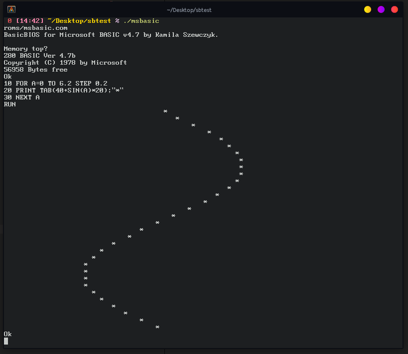

# tinyz80

A minimal Z80 implementation.

## Running the examples.

Compile the desired file in `src` to build a version of the raw emulator (located in `z80.c`) tailored for running one of the example programs. Currently, running Microsoft BASIC and the zexdoc/zexall test suite is supported, but making the emulator support more platforms (e.g. by implementing more BDOS services) can be easily done. It's relatively simple to ascertain the API of the emulator from the example code given, so a detailed reference isn't provided.
